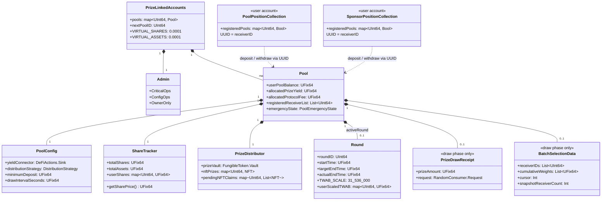
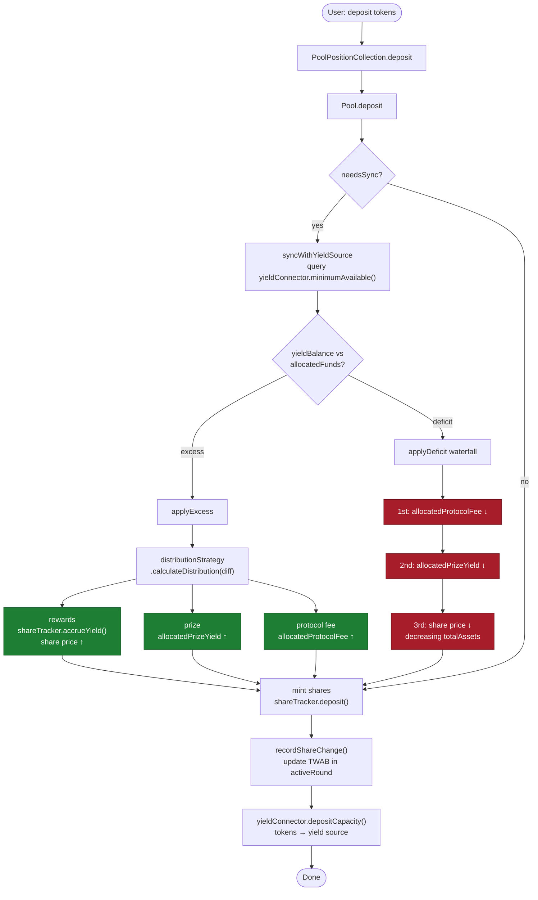
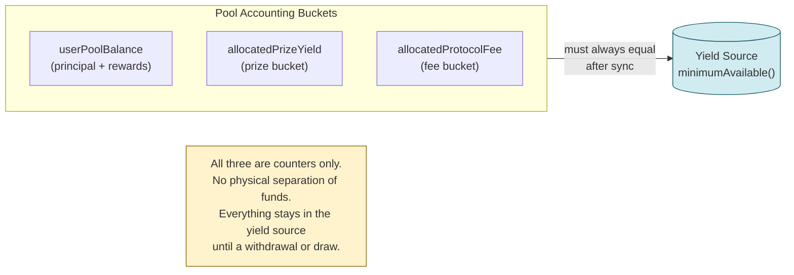

# System Diagram

---

## Resource Hierarchy

```mermaid
classDiagram
    class PrizeLinkedAccounts {
        +pools: map~UInt64, Pool~
        +nextPoolID: UInt64
        +VIRTUAL_SHARES: 0.0001
        +VIRTUAL_ASSETS: 0.0001
    }

    class Admin {
        +CriticalOps
        +ConfigOps
        +OwnerOnly
    }

    class Pool {
        +userPoolBalance: UFix64
        +allocatedPrizeYield: UFix64
        +allocatedProtocolFee: UFix64
        +registeredReceiverList: List~UInt64~
        +emergencyState: PoolEmergencyState
    }

    class PoolConfig {
        +yieldConnector: DeFiActions.Sink
        +distributionStrategy: DistributionStrategy
        +minimumDeposit: UFix64
        +drawIntervalSeconds: UFix64
    }

    class ShareTracker {
        +totalShares: UFix64
        +totalAssets: UFix64
        +userShares: map~UInt64, UFix64~
        +getSharePrice() UFix64
    }

    class Round {
        +roundID: UInt64
        +startTime: UFix64
        +targetEndTime: UFix64
        +actualEndTime: UFix64
        +TWAB_SCALE: 31_536_000
        +userScaledTWAB: map~UInt64, UFix64~
    }

    class PrizeDistributor {
        +prizeVault: FungibleToken.Vault
        +nftPrizes: map~UInt64, NFT~
        +pendingNFTClaims: map~UInt64, List~NFT~~
    }

    class PrizeDrawReceipt {
        <<draw phase only>>
        +prizeAmount: UFix64
        +request: RandomConsumer.Request
    }

    class BatchSelectionData {
        <<draw phase only>>
        +receiverIDs: List~UInt64~
        +cumulativeWeights: List~UFix64~
        +cursor: Int
        +snapshotReceiverCount: Int
    }

    class PoolPositionCollection {
        <<user account>>
        +registeredPools: map~UInt64, Bool~
        UUID = receiverID
    }

    class SponsorPositionCollection {
        <<user account>>
        +registeredPools: map~UInt64, Bool~
        UUID = receiverID
    }

    PrizeLinkedAccounts "1" *-- "1" Admin
    PrizeLinkedAccounts "1" *-- "many" Pool

    Pool "1" *-- "1" PoolConfig
    Pool "1" *-- "1" ShareTracker
    Pool "1" *-- "1" PrizeDistributor
    Pool "1" *-- "0..1" Round : activeRound
    Pool "1" *-- "0..1" PrizeDrawReceipt
    Pool "1" *-- "0..1" BatchSelectionData

    PoolPositionCollection ..> Pool : deposit / withdraw via UUID
    SponsorPositionCollection ..> Pool : deposit / withdraw via UUID
```

---

## Deposit → Yield Source → Accounting Loop

```mermaid
flowchart TD
    A([User: deposit tokens]) --> B[PoolPositionCollection.deposit]
    B --> C[Pool.deposit]
    C --> D{needsSync?}

    D -- yes --> E["syncWithYieldSource<br/>query yieldConnector.minimumAvailable()"]
    E --> F{"yieldBalance vs<br/>allocatedFunds?"}

    F -- excess --> G[applyExcess]
    G --> G1["distributionStrategy<br/>.calculateDistribution(diff)"]
    G1 --> G2["rewards<br/>shareTracker.accrueYield()<br/>share price ↑"]
    G1 --> G3["prize<br/>allocatedPrizeYield ↑"]
    G1 --> G4["protocol fee<br/>allocatedProtocolFee ↑"]

    F -- deficit --> H[applyDeficit waterfall]
    H --> H1["1st: allocatedProtocolFee ↓"]
    H1 --> H2["2nd: allocatedPrizeYield ↓"]
    H2 --> H3["3rd: share price ↓<br/>decreasing totalAssets"]

    G2 & G3 & G4 --> I
    H3 --> I
    D -- no --> I

    I["mint shares<br/>shareTracker.deposit()"] --> J["recordShareChange()<br/>update TWAB in activeRound"]
    J --> K["yieldConnector.depositCapacity()<br/>tokens → yield source"]
    K --> L([Done])

    style G2 fill:#1e7e34,color:#ffffff,stroke:#155724
    style G3 fill:#1e7e34,color:#ffffff,stroke:#155724
    style G4 fill:#1e7e34,color:#ffffff,stroke:#155724
    style H1 fill:#a71d2a,color:#ffffff,stroke:#721c24
    style H2 fill:#a71d2a,color:#ffffff,stroke:#721c24
    style H3 fill:#a71d2a,color:#ffffff,stroke:#721c24
```

---

## Draw Cycle

```mermaid
flowchart TD
    PRE{"allocatedPrizeYield > 0<br/>and round.hasEnded()?"}
    PRE -- yes --> SD

    SD["① startDraw<br/>access(all)"] --> SD1[syncWithYieldSource]
    SD1 --> SD2["withdraw allocatedProtocolFee<br/>forward to fee recipient"]
    SD2 --> SD3["requestRandomness<br/>commit block recorded"]
    SD3 --> SD4["snapshot receiver count<br/>create PrizeDrawReceipt<br/>create BatchSelectionData"]

    SD4 --> PB

    PB["② processDrawBatch(limit)<br/>access(all) — repeat until complete"] --> PB1["finalizeTWAB per user<br/>normalizedWeight = shares × elapsed ÷ duration"]
    PB1 --> PB2[append to cumulativeWeights]
    PB2 --> PB3{batch complete?}
    PB3 -- no --> PB
    PB3 -- yes --> CD

    CD["③ completeDraw<br/>access(all) — must be different block"] --> CD1["fulfillRandomRequest<br/>consume randomness"]
    CD1 --> CD2["selectWinners()<br/>binary search into cumulativeWeights"]
    CD2 --> CD3["for each winner:<br/>withdraw prize from yield source<br/>auto-compound into winner shares"]
    CD3 --> CD4["pool enters intermission<br/>destroy Round, receipt, batch data"]

    CD4 --> SNR

    SNR["④ startNextRound<br/>ConfigOps"] --> SNR1["create new Round<br/>clear intermission"]
    SNR1 --> DONE([New round active])

    style SD fill:#1a6496,color:#ffffff,stroke:#0d3a5c
    style PB fill:#1a6496,color:#ffffff,stroke:#0d3a5c
    style CD fill:#1a6496,color:#ffffff,stroke:#0d3a5c
    style SNR fill:#6133a0,color:#ffffff,stroke:#3d1a6e
```

---

## Accounting Invariant

```mermaid
flowchart LR
    YS[("Yield Source<br/>minimumAvailable()")]

    subgraph Accounting ["Pool Accounting Buckets"]
        A["userPoolBalance<br/>(principal + rewards)"]
        B["allocatedPrizeYield<br/>(prize bucket)"]
        C["allocatedProtocolFee<br/>(fee bucket)"]
    end

    Accounting -- "must always equal<br/>after sync" --> YS

    note["All three are counters only.<br/>No physical separation of funds.<br/>Everything stays in the yield source<br/>until a withdrawal or draw."]

    style note fill:#fff3cd,stroke:#856404
    style YS fill:#d1ecf1,stroke:#0c5460
```
